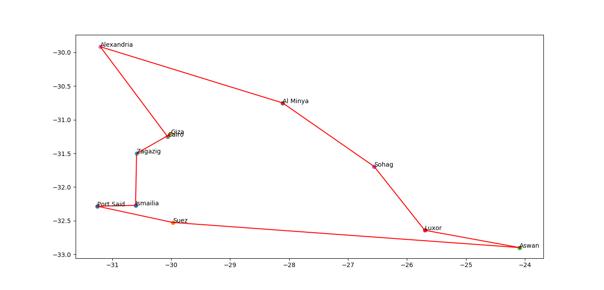

## The Travelling Salesman Problem solved using The Genetic Algorithm

Firstly, we will explain how the genetic algorithm works.

Algorithm Steps
---------------

1.  Initialize the population with the input data with a specified population size.

2.  Evaluate the population with specific criterion.

3.  Iterate with a previously specified number of generations produced:

    1.  Apply a selection method on the population from either the Tournament method or Roulette-Wheel method.

    2.  Recombination of new population using cross-over and mutation methods to generate new children from older parents in the population.

    3.  Use Elitist technique and take top 10% of chromosomes and replace the other 90% with the new offspring chromosomes.

TSP Solution using GA
---------------------

We will explain it step by step how we can use the genetic algorithm to solve the TSP.

-   First, The initialized population contains N possible routes with non-repeated nodes (cities).

-   A fitness function calculates the total distance between each city in the chromosome’s permutation. The chromosome’s fitness is set to the overall sum of all distances within the permutation. The smaller the overall distance, the higher the fitness of the route.

-   In the selection step, we implemented both the Tournament method and the Roulette-Wheel method.

-   In the Tournament method, we choose two routes randomly and get the champ that has the best fitness and do this in every iteration.

-   In the Roulette-Wheel method, the choosing isn’t random but is built on a pre-built probability distribution calculated using the fitness of the route and divided by the sum of all the fitnesses of all routes. Then generate a random number and compute the position of this number in the prob-dist to know which route to take.

-   Then take the selected chromosomes and apply the crossover step.

-   In the crossover, two chromosomes (parents) are taken to generate new generation (children). To create the first child, copy part of the first parent’s chromosome to the child’s chromosome. Then choose valid non-repeating genes from the second parent in the order that they appear to the empty values in the child’s chromosome. To create the chromosome for the second child, repeat this process inversely by copying part of the second parent’s chromosome and using valid values from the first parent for the remaining values.

-   In the next step, we will make some mutation to the chromosomes. But to avoid repeating genes, we two random genes with each other.

-   Finally, the replacement is done by taking top 10% from the previous generation and the other 90% is taken from the new offspring chromosomes.

Running the Code
----------------

    python main.py --pop_size 500 --mut_rate 0.05 --n_gen 30 
                   --cities cities.csv --selector rw --verbose 1

Experiments
-----------

Input
-----

For a given input in a csv file format:

| city  | latitude | longitude |
| ------------- | ------------- | ------------- |
| Cairo  | 30.0626297  | 31.24967 |
| Alexandria  | 31.2017593 | 29.9158192 |
| Giza | 30.0080795 | 31.2109299 |
| Port Said | 31.2565403 | 32.284111 |
| Suez | 29.9737091 | 32.5262718 |
| Luxor | 25.6989307 | 32.6421013 |
| Aswan | 24.0908203 | 32.8994217 |
| Al Minya | 28.1098804 | 30.7502995 |
| Sohag | 26.5569496 | 31.6947803 |
| Zagazig | 30.5876808 | 31.5020008 |
| Ismailia | 30.6042709 | 32.2722511 |

Visualization
-------------

